# Cablebot hardware
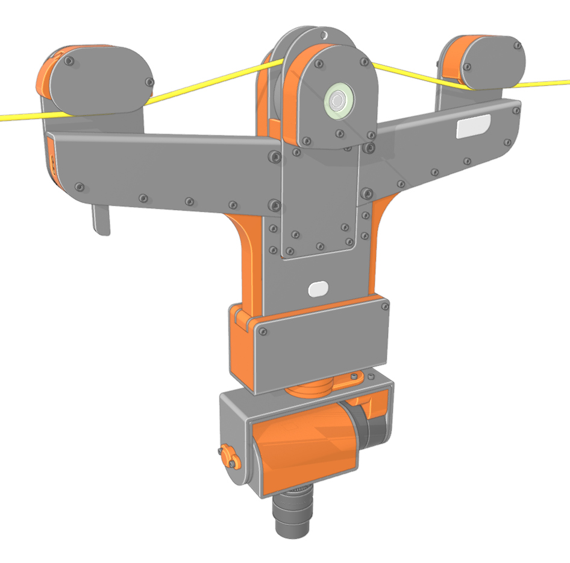 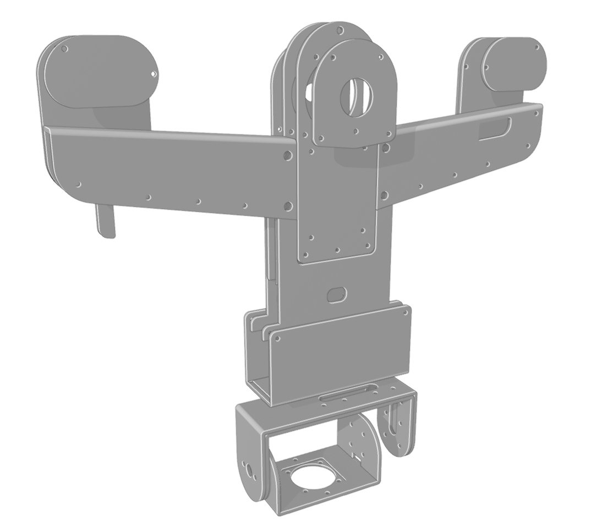 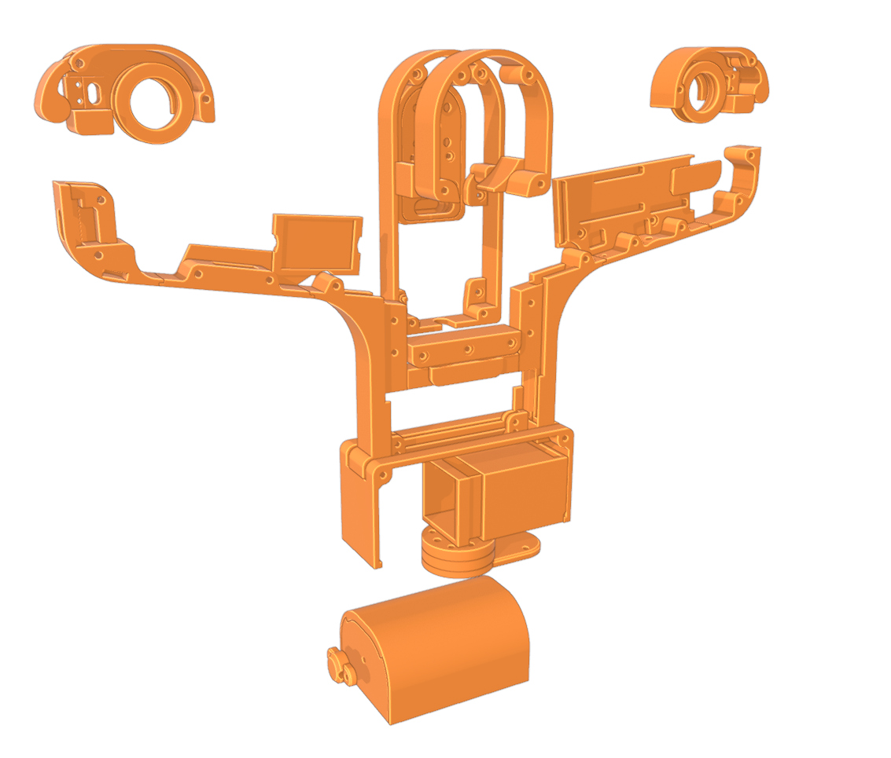

## Head
### 3d printed PLA
 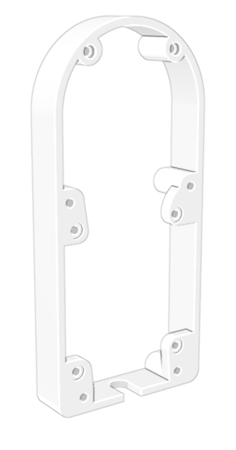 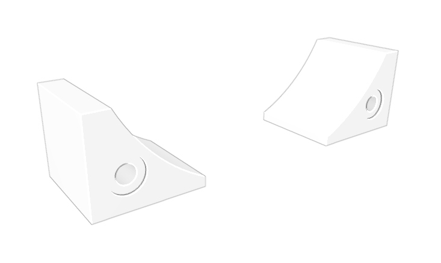 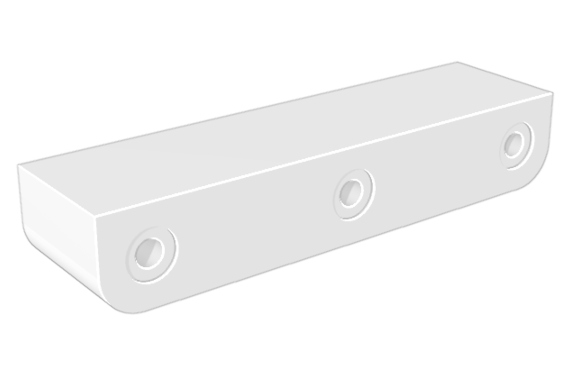 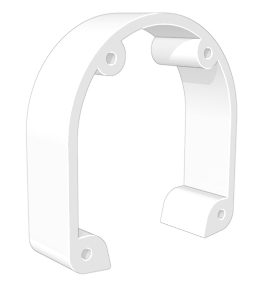 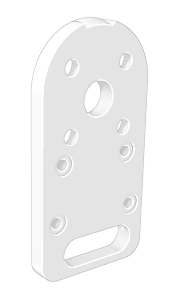

|       |                                                                      |
| :---: | ---                                                                  |
| 1x    | [Encoder cap](./3d-Print/Cablebot-Encoder_cap.stl)                   |
| 1x    | [Head separator front](./3d-Print/Cablebot-Head_separator_front.stl) |
| 1x    | [Head separator up](./3d-Print/Cablebot-Head_separator_up.stl)       |
| 1x    | [Spring holder up](./3d-Print/Cablebot-Spring_holder_Up.stl)         |
| 1x    | [Head separator back](./3d-Print/Cablebot-Head_separator_back.stl)   |
| 1x    | [Encoder holder](./3d-Print/Cablebot-Encoder_holder.stl)             |

### Milled Alucobond
 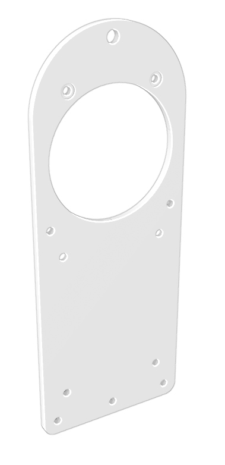 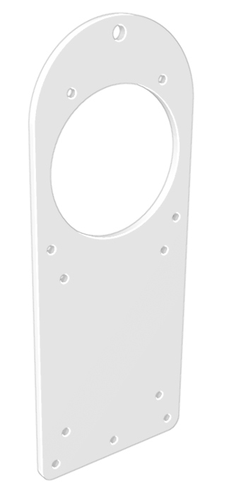 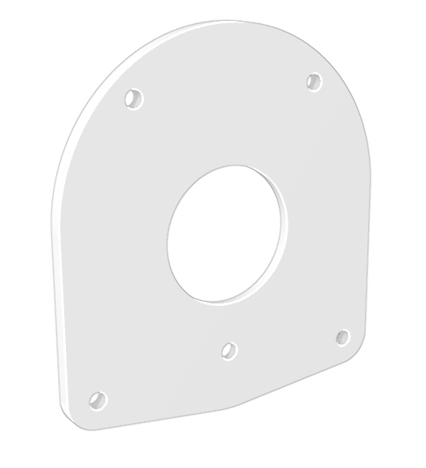

|       |                                                                        |
| :---: | ---                                                                    |
| 1x    | [Head front](./Milled-Alucobond/Cablebot-Head_front.dxf)               |
| 1x    | [Head middle front](./Milled-Alucobond/Cablebot-Head_middle_front.dxf) |
| 1x    | [Head middle back](./Milled-Alucobond/Cablebot-Head_middle_back.dxf)   |
| 1x    | [Head back](./Milled-Alucobond/Cablebot-Head_back.dxf)                 |

## Arms
### 3d printed PLA
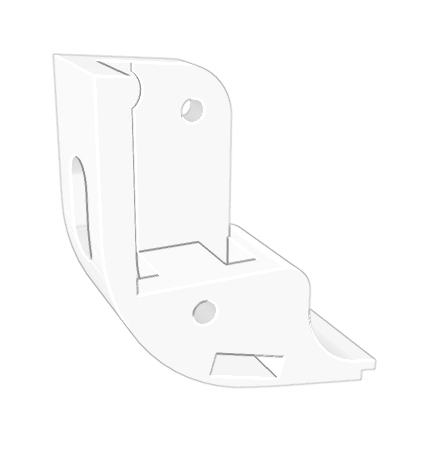 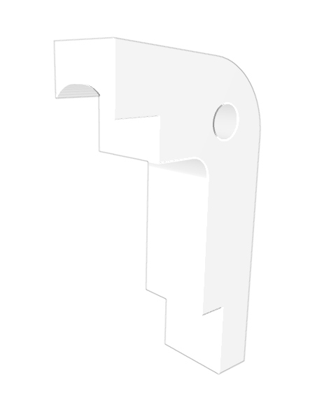 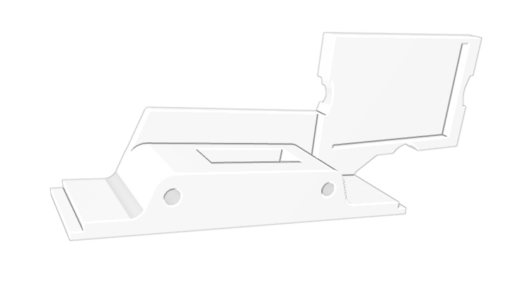 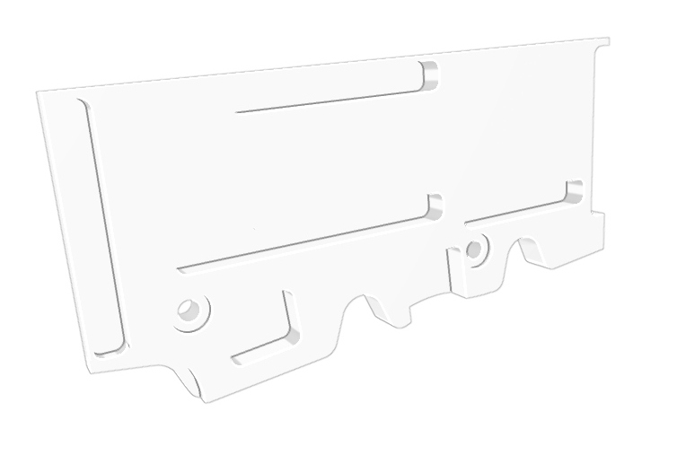 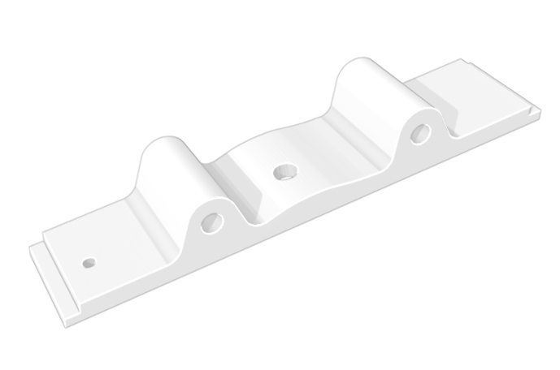 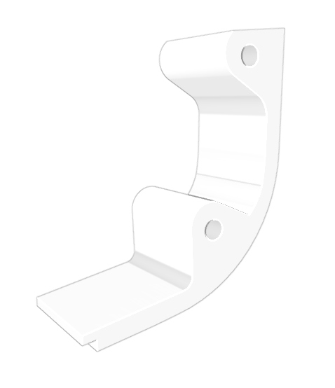

|       |                                                                              |
| :---: | ---                                                                          |
| 1x    | [Left arm cap out](./3d-Print/Cablebot-Left_arm_cap_out.stl)                 |
| 1x    | [Pogo pin clip](./3d-Print/Cablebot-Pogo_pin_clip.stl)                       |
| 1x    | [Left arm cap middle](./3d-Print/Cablebot-Left_arm_cap_middle.stl)           |
| 1x    | [Control board pcb holder](./3d-Print/Cablebot-Control_board_pcb_holder.stl) |
| 1x    | [Right arm cap middle](./3d-Print/Cablebot-Right_arm_cap_middle.stl)         |
| 1x    | [Right arm cap out](./3d-Print/Cablebot-Right_arm_cap_out.stl)               |

### Milled Alucobond
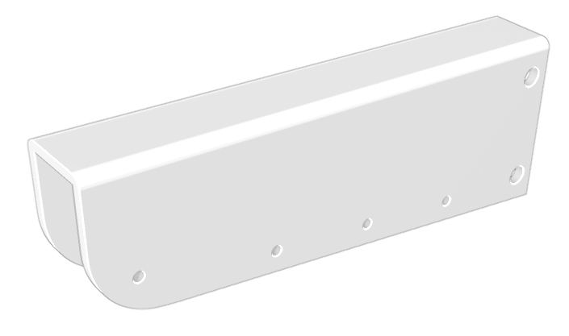 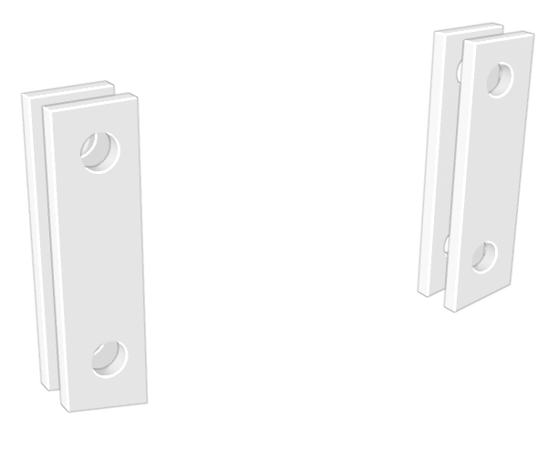 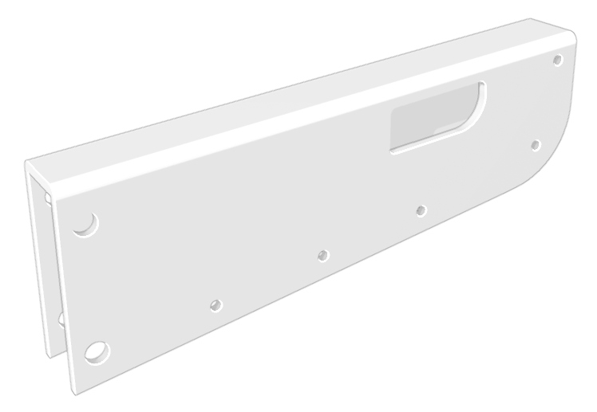

|       |                                                                      |
| :---: | ---                                                                  |
| 1x    | [Arm left](./Milled-Alucobond/Cablebot-Arm_left.dxf)                 |
| 4x    | [Arms slider fill](./Milled-Alucobond/Cablebot-Arms_slider_fill.dxf) |
| 4x    | [Arm right](./Milled-Alucobond/Cablebot-Arms_right.dxf)              |

## Hands
### 3d printed PLA
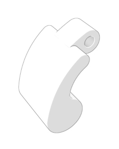 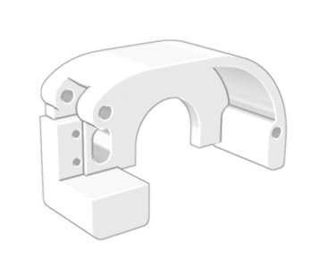 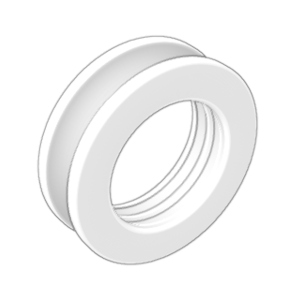 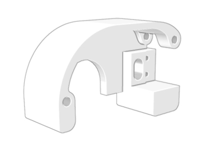 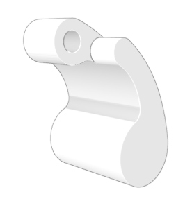

|       |                                                                                    |
| :---: | ---                                                                                |
| 1x    | [Hand end stop trigger left](./3d-Print/Cablebot-Hand_end_stop_trigger_left.stl)   |
| 1x    | [Hand base left](./3d-Print/Cablebot-Hand_base_left.stl)                           |
| 2x    | [Pulley 608zz](./3d-Print/Cablebot-Pulley_608zz.stl)                               |
| 1x    | [Hand base right](./3d-Print/Cablebot-Hand_base_right.stl)                         |
| 1x    | [Hand end stop trigger right](./3d-Print/Cablebot-Hand_end_stop_trigger_right.stl) |

### Milled Alucobond
 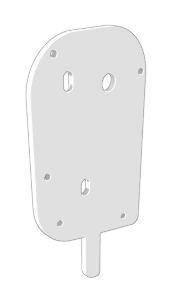 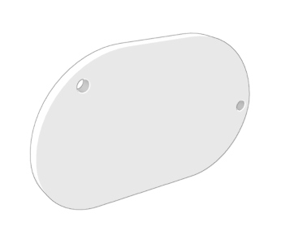 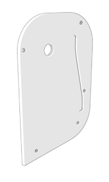 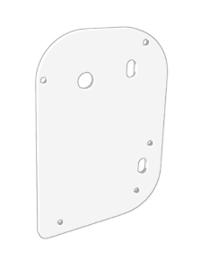 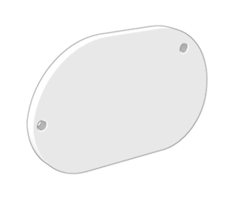 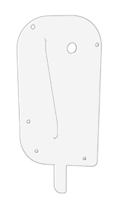 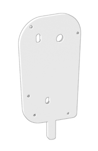 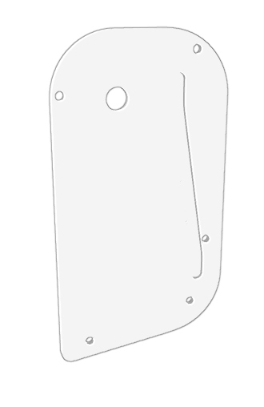 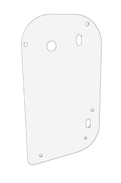

|       |                                                                                    |
| :---: | ---                                                                                |
| 1x    | [Hand left out small](./Milled-Alucobond/Cablebot-Hand_left_out_small.dxf)         |
| 1x    | [Hand left middle small](./Milled-Alucobond/Cablebot-Hand_left_middle_small.dxf)   |
| 1x    | [Hand front left](./Milled-Alucobond/Cablebot-Hand_front_left.dxf)                 |
| 1x    | [Hand right out small](./Milled-Alucobond/Cablebot-Hand_right_out_small.dxf)       |
| 1x    | [Hand right middle small](./Milled-Alucobond/Cablebot-Hand_right_middle_small.dxf) |
| 1x    | [Hand front right](./Milled-Alucobond/Cablebot-Hand_front_right.dxf)               |
| 1x    | [Hand left out big](./Milled-Alucobond/Cablebot-Hand_left_out_big.dxf)             |
| 1x    | [Hand left middle big](./Milled-Alucobond/Cablebot-Hand_left_middle_big.dxf)       |
| 1x    | [Hand right out big](./Milled-Alucobond/Cablebot-Hand_right_out_big.dxf)           |
| 1x    | [Hand right middle big](./Milled-Alucobond/Cablebot-Hand_right_middle_big.dxf)     |

Just one set is needed either _small_ or _big_, depending on cable tension (big is better for high tension).

## Body 
### 3d printed PLA
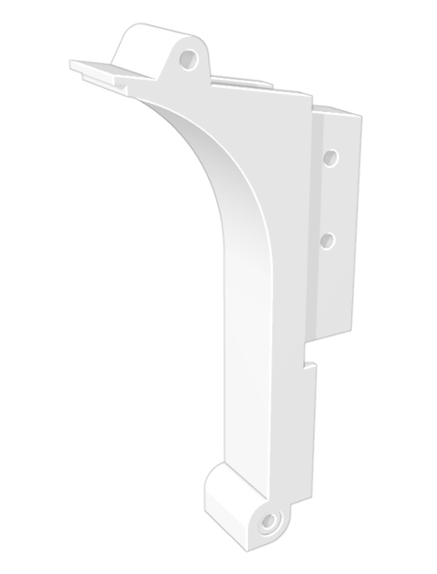 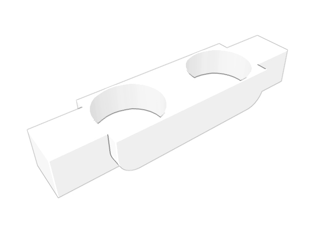 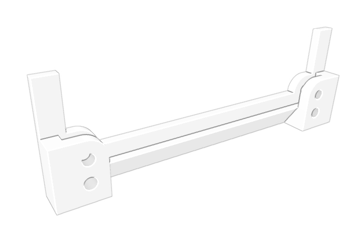 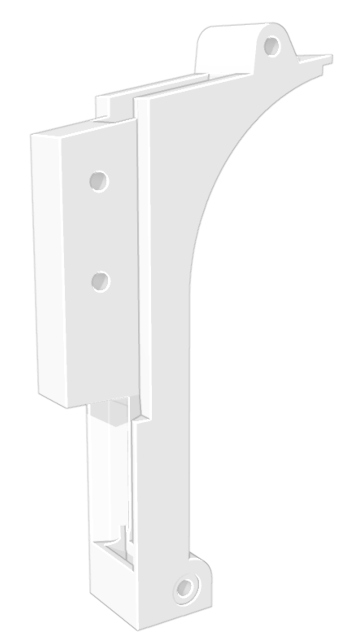

|       |                                                                  |
| :---: | ---                                                              |
| 1x    | [Cable bridge left](./3d-Print/Cablebot-Cable_bridge_left.stl)   |
| 1x    | [Spring holder down](./3d-Print/Cablebot-Spring_holder_down.stl) |
| 1x    | [Power pcb holder](./3d-Print/Cablebot-Power_pcb_holder.stl)     |
| 1x    | [Cable bridge right](./3d-Print/Cablebot-Cable_bridge_right.stl) |

### Milled Alucobond
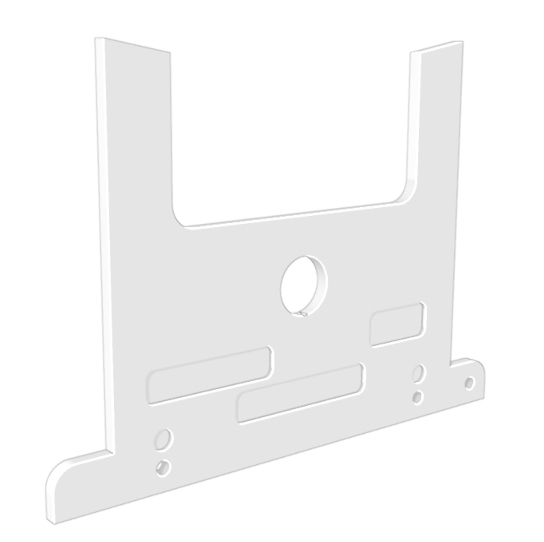 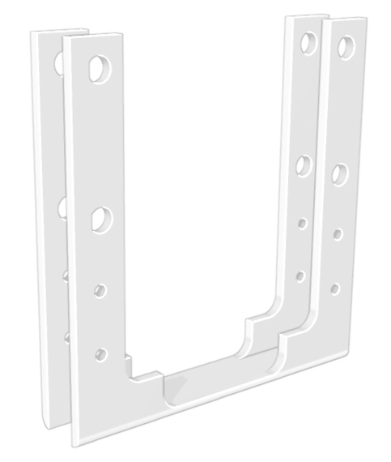 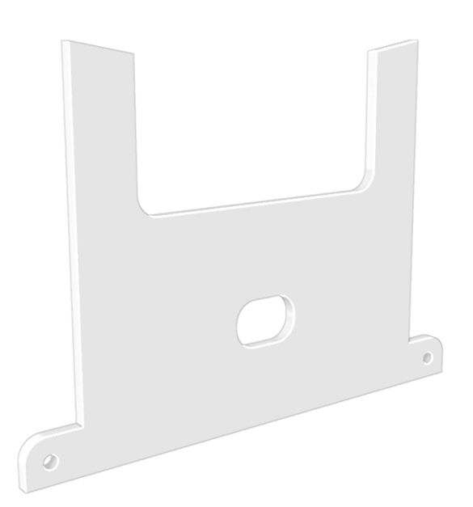

|       |                                                                            |
| :---: | ---                                                                        |
| 1x    | [Body cover back](./Milled-Alucobond/Cablebot-Body_cover_back.dxf)         |
| 1x    | [H holder](./Milled-Alucobond/Cablebot-H_holder.dxf)                       |
| 1x    | [Body cover front](./Milled-Alucobond/Cablebot-Body_cover_front.dxf)       |

## Battery module
### 3d printed PLA
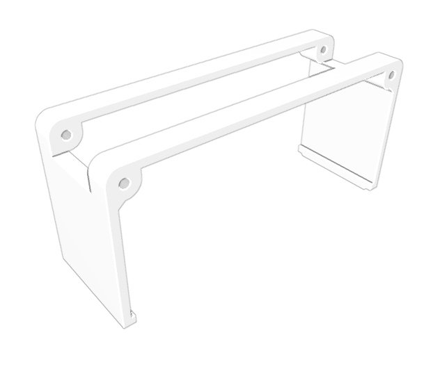 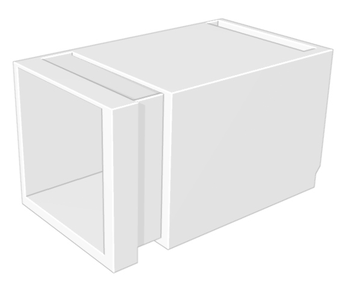 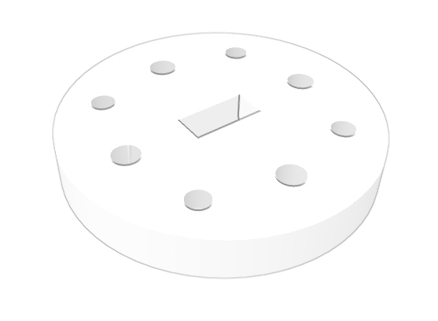 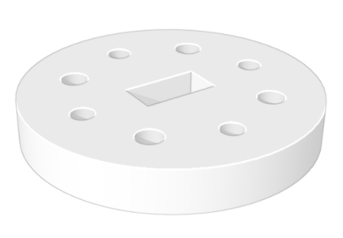

|       |                                                                                           |
| :---: | ---                                                                                       |
| 1x    | [Battery cap](./3d-Print/Cablebot-Battery_cap.stl)                                        |
| 1x    | [Battery and BMS box](./3d-Print/Cablebot-Battery_and_BMS_box.stl)                        |
| 1x    | [Battery connector top](./3d-Print/Cablebot-Battery_connector_top.stl)                    |
| 1x    | [Battery connector bottom](./3d-Print/Cablebot-Battery_connector_bottom.stl)              |

### Milled Alucobond
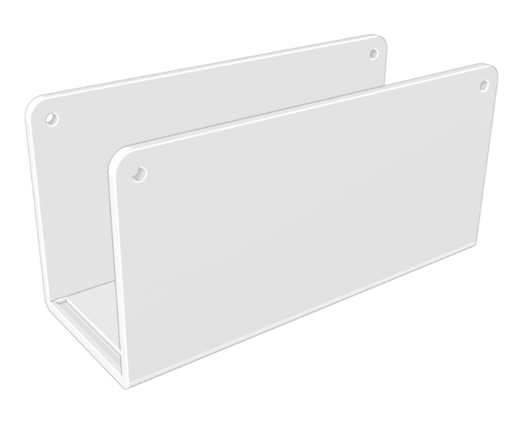

|       |                                                                            |
| :---: | ---                                                                        |
| 1x    | [Battery cover](./Milled-Alucobond/Cablebot-Battery_cover.dxf)             |

## Camera module
### 3d printed PLA
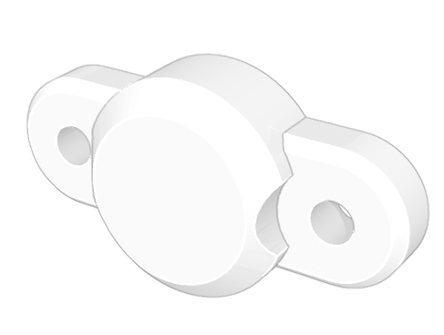 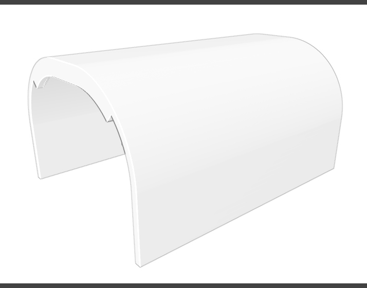 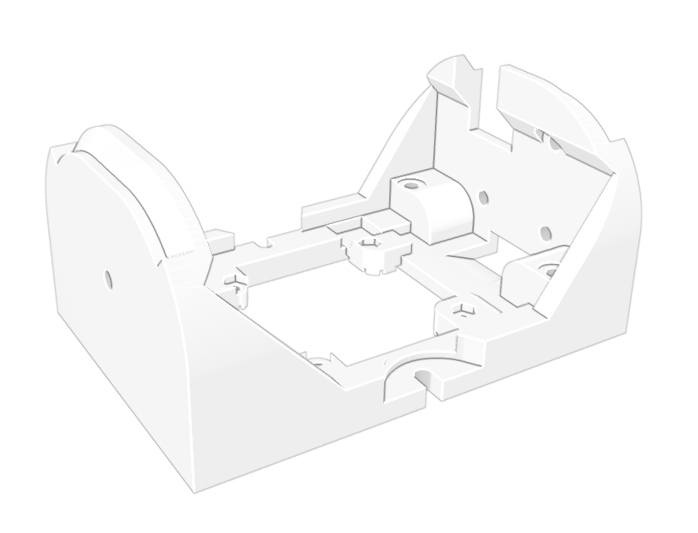 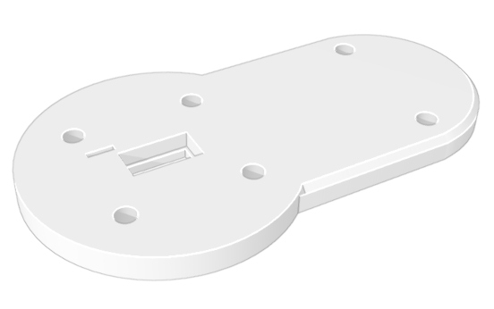 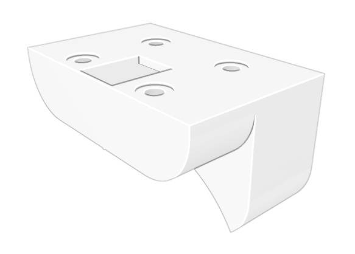

|       |                                                                     |
| :---: | ---                                                                 |
| 1x    | [Bearing cap](./3d-Print/Camera_module-Bearing_cap.stl)             |
| 1x    | [Main cap](./3d-Print/Camera_module-Main_Cap.stl)                   |
| 1x    | [Pcb holder](./3d-Print/Camera_module-PCB_holder.stl)               |
| 1x    | [Top connector cap](./3d-Print/Camera_module-Top_connector_cap.stl) |
| 1x    | [Corner motor top](./3d-Print/Camera_module-Corner_motor_top.stl)   |

### Milled Alucobond
 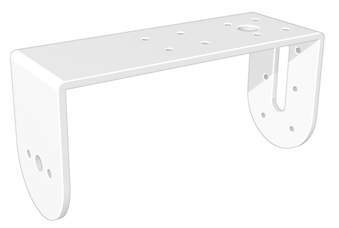 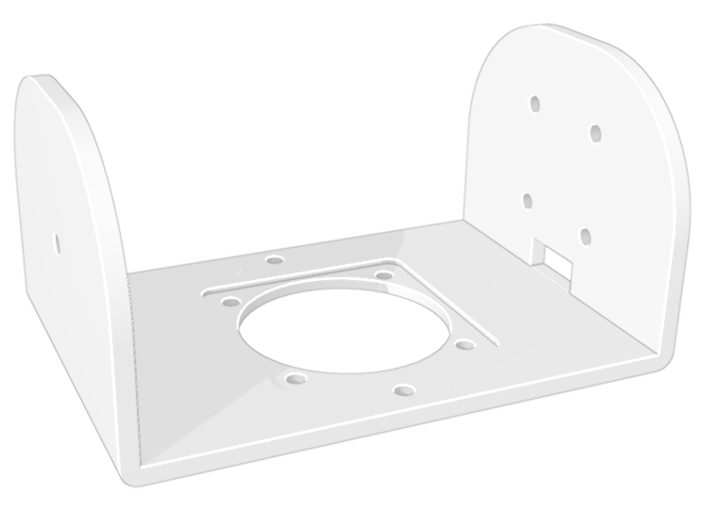

|       |                                                                     |
| :---: | ---                                                                 |
| 1x    | [Holder top](./Milled-Alucobond/Camera_module-Holder_top.dxf)       |
| 1x    | [Holder bottom](./Milled-Alucobond/Camera_module-Holder_bottom.dxf) |
| 1x    | [Holder camera](./Milled-Alucobond/Camera_module-Holder_camera.dxf) |
